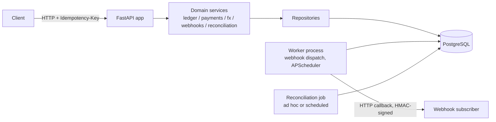

# Instant Payment Ledger & API

[](https://github.com/HaydenC22/Instant-Payment-Ledger---API/actions/workflows/ci.yml)
[](https://github.com/HaydenC22/Instant-Payment-Ledger---API/actions/workflows/codeql.yml)

A PayNow/FAST-style domestic transfer service built around a **genuinely correct double-entry ledger**, not a CRUD app with a `balance` column.

## Problem

Instant domestic payment schemes (PayNow, FAST, and similar real-time rails) need sub-second transfers with zero tolerance for double-charging a customer and a ledger that can be audited line by line. Most student payment projects fake this with a single mutable `balance` integer and a naive retry story. This project instead implements:

- **Double-entry accounting** with immutable journal entries — balances are always derived (`SUM` over journal lines), never stored or mutated directly.
- **A domain-enforced payment lifecycle** (`initiated → authorised → settled → reversed/failed`) — illegal transitions are rejected in the domain layer itself, not just in a controller `if` statement.
- **Idempotency keys** on payment initiation, so a client retry after a network timeout can never double-post a transfer — proven with a real concurrency test, not just an assumption (see [Metrics](#metrics) below).
- **Partial ISO 20022 messaging** (`pain.001` / `pacs.008`) — the messaging standard real banks migrated to.
- **Webhooks** with a transactional outbox, exponential backoff, and a dead-letter queue.
- **End-of-day reconciliation** against a settlement file, reporting breaks by type.
- **SGQR-style QR generation** and **multi-currency transfers** with a booked, non-re-priceable FX leg.

## Architecture



`app/domain/` has no dependency on FastAPI or SQLAlchemy — domain services depend on repository protocols, and `app/infra/` supplies the Postgres-backed implementations. This is what makes "illegal transitions rejected at the domain layer" true in practice, and lets the ledger invariant, state machine, and FX conversion logic all be unit-tested without a database (`tests/unit/domain/`), with the real Postgres behaviour proven separately (`tests/integration/`).

## Tech stack

| Layer | Choice |
|---|---|
| API | FastAPI, Pydantic v2 |
| Persistence | PostgreSQL 16, SQLAlchemy 2.0 (async/asyncpg), Alembic |
| Background jobs | APScheduler (webhook dispatch loop, single worker process) |
| Messaging | ISO 20022 XML (pain.001 / pacs.008) via XXE-hardened lxml |
| QR | SGQR-style EMV-QR TLV encoding, `qrcode` for PNG rendering |
| Testing | pytest, pytest-asyncio, Testcontainers (real Postgres), Hypothesis (property tests) |
| Load testing | k6 |
| CI/CD | GitHub Actions, CodeQL, Dependabot |
| Runtime | Docker, Docker Compose |

## Run it

```bash
cp .env.example .env
docker compose up
```

```
 Container instantpaymentledgerapi-db-1      Healthy
 Container instantpaymentledgerapi-worker-1  Started
 Container instantpaymentledgerapi-api-1     Started
```

The API is available at `http://localhost:8000`, with interactive docs at `http://localhost:8000/docs`. The `api` service runs Alembic migrations automatically on startup — including seeding a small mock FX rate table and an FX suspense account, so cross-currency transfers work immediately with no manual setup.

```bash
curl http://localhost:8000/health      # process is up
curl http://localhost:8000/health/db   # database is reachable
```

Verified end-to-end from a clean `docker compose up --build`: DB healthy and API serving in well under 60 seconds.

## A payment, and its SGQR code

`POST /qr/generate` against any account returns a scannable SGQR-style QR (and the raw EMVCo TLV payload in a response header) for receiving a payment into that account:


## Build status

All eight build milestones are complete:

- [x] Project scaffolding — FastAPI skeleton, Docker Compose (api + db + worker), Alembic, CI (lint/test/build), CodeQL, Dependabot
- [x] Double-entry ledger core + concurrency handling — accounts, immutable journal entries/lines, derived balances, optimistic-lock retry on concurrent postings
- [x] Payment lifecycle state machine — `initiated → authorised → settled → reversed/failed`, illegal transitions rejected in the domain layer; settle/reverse post their ledger entry and flip payment status in one atomic transaction
- [x] Idempotency keys — required `Idempotency-Key` header on payment initiation, two-phase claim/complete design (ADR-0002), proven with a real concurrent-retry test
- [x] ISO 20022 pain.001 / pacs.008 — `POST /iso20022/pain001` ingests a credit transfer initiation (account numbers resolved to internal accounts), `GET /iso20022/{id}/pacs008` emits the settled FI-to-FI message; XXE-hardened XML parsing
- [x] Webhooks + dead-letter queue — transactional outbox (delivery enqueued in the same transaction as the payment state change), HMAC-signed delivery, exponential backoff, `GET /webhooks/dead-letters`; dispatched by a dedicated `worker` service
- [x] Reconciliation job — matches settled payments against a settlement CSV by end-to-end ID, reporting `missing_in_settlement` / `missing_in_ledger` / `amount_mismatch` breaks; runnable via `POST /reconciliation/run`, `GET /reconciliation/runs/{id}`, or ad hoc as `docker compose exec worker python -m app.workers.reconciliation_job <file>`
- [x] SGQR QR generation + multi-currency FX — `POST /qr/generate` emits an EMV-QR-style PNG; cross-currency settlement books a 4-line FX conversion entry through a suspense account, with reversal always undoing the exact amount booked (not a freshly re-priced one)
- [x] Load testing + final metrics — see below

## Metrics

All numbers below are real, captured against `docker compose up` on a laptop (Docker Desktop, no cloud infrastructure) — see `loadtest/results/summary.md` for the full write-up including a before/after connection-pool tuning pass.

| Metric | Value |
|---|---|
| Test suite | 181 tests passing (unit + integration against real Postgres) |
| Coverage | 96% (`pytest --cov=app`) |
| Idempotency proof | 20 concurrent identical `POST /payments` requests → **exactly 1 payment created** (`python scripts/prove_idempotency.py`) |
| API p95 latency under load | 781 ms (ramping 0→100 VUs, `k6 run loadtest/k6/payments_load.js`) |
| Sustained throughput | 142.9 req/s, **0% error rate** across 15,837 requests |
| Connection-pool tuning | p95 1078 ms → 781 ms (−28%) after raising the DB pool from its 15-connection default |

The idempotency proof is also checked automatically on every push, parametrized over 3 repeated runs to catch flakiness rather than passing once and lying:
`tests/integration/test_idempotency_api.py::test_n_concurrent_identical_requests_create_exactly_one_payment`.

## Testing & CI

```bash
pytest tests/unit tests/integration --cov=app
```

Integration tests spin up a real PostgreSQL instance via Testcontainers — no mocked database. Concurrency claims (optimistic-lock retries, idempotent retries, FX reversal correctness) are proven by firing real concurrent requests at real Postgres and asserting the final state is exactly right, not just "usually" right. GitHub Actions runs lint (ruff, black, bandit), the full test suite with coverage, and a Docker build check on every push.

## Security

- All data used by this project is synthetic or open-source. No production or personal data is used anywhere in this repository.
- ISO 20022 XML ingestion is parsed with an XXE-hardened lxml parser (`resolve_entities`/`load_dtd`/`dtd_validation` all off, plus an outright DOCTYPE rejection) — verified empirically, not just configured, that an external entity reference resolves to no text rather than leaking file contents.
- Webhook deliveries are HMAC-SHA256 signed; subscription secrets are never echoed back in API responses.
- Dependabot watches `pip`, `github-actions`, and `docker` dependencies weekly.
- CodeQL static analysis runs in CI; Bandit runs as a fast Python-specific check on every push.
- Secrets are never committed — see `.env.example` for required configuration, and GitHub secret scanning + push protection is enabled on this repository.

## Architecture Decision Records

Short records of the decisions that aren't obvious from the code alone — see [`docs/adr/`](docs/adr/):

- [0001 — Derived balances over a mutable `balance` column](docs/adr/0001-derived-balances.md)
- [0002 — Idempotency key storage & the two-phase claim/complete split](docs/adr/0002-idempotency-key-storage.md)
- [0003 — Optimistic locking via an account-level version token](docs/adr/0003-optimistic-locking.md)
- [0004 — A seeded mock FX rate feed, not a live market connection](docs/adr/0004-mock-fx-rate-feed.md)
- [0005 — Transactional outbox for webhook delivery](docs/adr/0005-transactional-outbox-for-webhooks.md)

## What's next

- Live deployment (Fly.io or Render free tier)
- React + TypeScript operator dashboard
- Real-time FX rate feed instead of a mock table (ADR-0004 — no interface change needed, only the seed source)
- Full ISO 20022 XSD schema validation
- Pessimistic-lock fallback path under extreme single-account contention (ADR-0003)
- Idempotency-key TTL/expiry sweep for the crash-orphan edge case (ADR-0002)
- Row-level claim/lease for the webhook dispatcher, needed only if scaled to multiple worker replicas (ADR-0005)

## License

MIT
