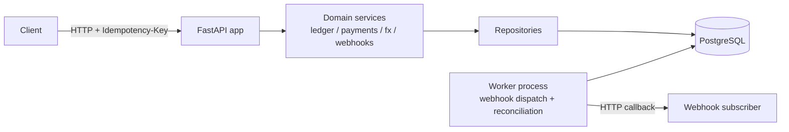

# Instant Payment Ledger & API

[](https://github.com/OWNER/REPO/actions/workflows/ci.yml)
[](https://github.com/OWNER/REPO/actions/workflows/codeql.yml)

> Badge links use an `OWNER/REPO` placeholder until this is pushed to GitHub — update them once a remote exists.

A PayNow/FAST-style domestic transfer service built around a **genuinely correct double-entry ledger**, not a CRUD app with a `balance` column.

## Problem

Instant domestic payment schemes (PayNow, FAST, and similar real-time rails) need sub-second transfers with zero tolerance for double-charging a customer and a ledger that can be audited line by line. Most student payment projects fake this with a single mutable `balance` integer and a naive retry story. This project instead implements:

- **Double-entry accounting** with immutable journal entries — balances are always derived (`SUM` over journal lines), never stored or mutated directly.
- **A domain-enforced payment lifecycle** (`initiated → authorised → settled → reversed/failed`) — illegal transitions are rejected in the domain layer itself, not just in a controller `if` statement.
- **Idempotency keys** on every mutating endpoint, so a client retry after a network timeout can never double-post a transfer.
- **Partial ISO 20022 messaging** (`pain.001` / `pacs.008`) — the messaging standard real banks migrated to.
- **Webhooks** with exponential backoff and a dead-letter queue.
- **End-of-day reconciliation** against a mock settlement file, reporting breaks.
- **SGQR-style QR generation** and **multi-currency transfers** with a booked FX leg.

*Status: under active build — see [Build status](#build-status) below for what's implemented so far.*

## Architecture



`app/domain/` has no dependency on FastAPI or SQLAlchemy — domain services depend on repository protocols, and `app/infra/` supplies the Postgres-backed implementations. This is what makes "illegal transitions rejected at the domain layer" true in practice, and lets the ledger invariant and state machine be unit-tested without a database.

## Tech stack

| Layer | Choice |
|---|---|
| API | FastAPI, Pydantic v2 |
| Persistence | PostgreSQL, SQLAlchemy 2.0 (async/asyncpg), Alembic |
| Messaging | ISO 20022 XML (pain.001 / pacs.008) |
| QR | SGQR-style EMV-QR TLV encoding |
| Testing | pytest, pytest-asyncio, Testcontainers, Hypothesis |
| Load testing | k6 |
| CI/CD | GitHub Actions, CodeQL, Dependabot |
| Runtime | Docker, Docker Compose |

## Run it

```bash
cp .env.example .env
docker compose up
```

The API becomes available at `http://localhost:8000`, with interactive docs at `http://localhost:8000/docs`. On startup the `api` service runs Alembic migrations automatically before serving traffic. Health checks:

```bash
curl http://localhost:8000/health      # process is up
curl http://localhost:8000/health/db   # database is reachable
```

## Build status

This project is being built in milestones (see `docs/adr/` for design decisions as they're written). Currently implemented:

- [x] Project scaffolding — FastAPI skeleton, Docker Compose (api + db), Alembic wired up, CI (lint/test/build), CodeQL, Dependabot
- [x] Double-entry ledger core + concurrency handling — accounts, immutable journal entries/lines, derived balances, optimistic-lock retry on concurrent postings
- [x] Payment lifecycle state machine — `initiated → authorised → settled → reversed/failed`, illegal transitions rejected in the domain layer; settle/reverse post their ledger entry and flip payment status in one atomic transaction
- [x] Idempotency keys — required `Idempotency-Key` header on payment initiation, with a `POST /payments` retry-storm test proving N concurrent identical requests create exactly one payment
- [x] ISO 20022 pain.001 / pacs.008 — `POST /iso20022/pain001` ingests a credit transfer initiation (account numbers resolved to internal accounts), `GET /iso20022/{id}/pacs008` emits the settled FI-to-FI message; XXE-hardened XML parsing
- [ ] Webhooks + dead-letter queue
- [ ] Reconciliation job
- [ ] SGQR QR generation + multi-currency FX
- [ ] Load testing results + final metrics

## Testing & CI

```bash
pytest tests/unit tests/integration --cov=app
```

Integration tests spin up a real PostgreSQL instance via Testcontainers — no mocked database. GitHub Actions runs lint (ruff, black, bandit), the full test suite with coverage, and a Docker build check on every push.

## Security

- All data used by this project is synthetic or open-source. No production or personal data is used anywhere in this repository.
- Dependabot watches `pip`, `github-actions`, and `docker` dependencies weekly.
- CodeQL static analysis runs in CI; Bandit runs as a fast Python-specific check.
- Secrets are never committed — see `.env.example` for required configuration, and GitHub secret scanning + push protection is enabled on this repository.

## What's next

- Live deployment (Fly.io or Render free tier)
- React + TypeScript operator dashboard
- Real-time FX rate feed instead of a mock table
- Full ISO 20022 XSD schema validation
- Pessimistic-lock fallback path under extreme single-account contention

## License

MIT
